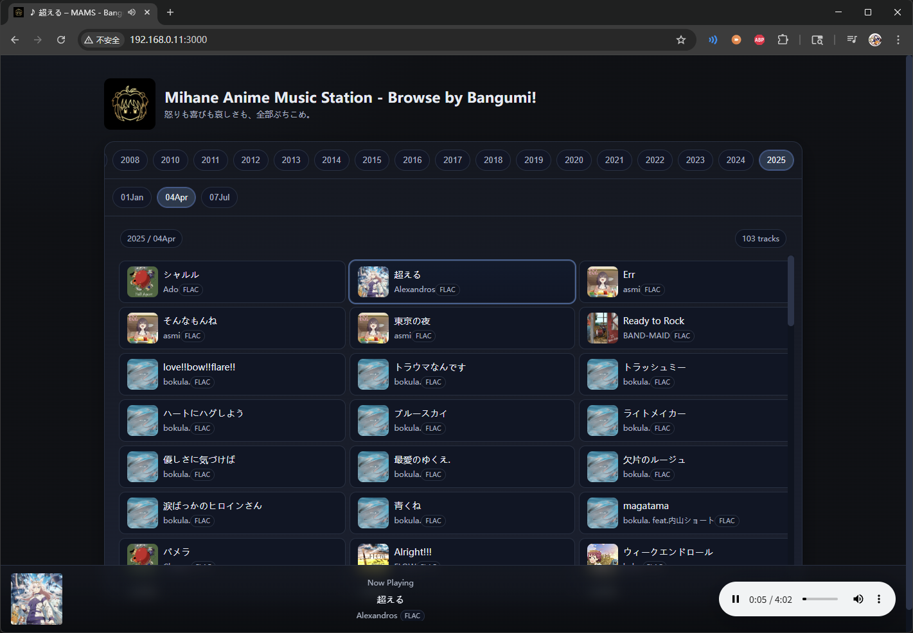

# Mihane Anime Music Station - Browse by Bangumi!

## Overview

**Mihane Anime Music Station - Browse by Bangumi!** is a lightweight web application that serves as a front-end interface for **MAMS (Mihane Anime Music Station)**. It allows you to browse, stream, and enjoy anime music organized by year and season, complete with album covers.  

This project is designed to be minimal, modern, and easy to deploy, making your personal music collection accessible through a web browser.

---

## Features

- Browse songs by **year** and **season**.  
- Stream music directly from the server.  
- Display embedded **album covers** or fallback cover images.  
- Lightweight and responsive UI for desktop and mobile.  

---

## Installation

### **1. Clone the Repository**

```bash
git clone https://github.com/yourusername/bangumi-music-server.git
cd bangumi-music-server
```

### **2. Configure Music Folder**

Edit the ```docker-compose.yml``` to point to the music directory (read-only):
```yaml
volumes:
  - /path/to/your/music:/music:ro
```
Folder structure (recommended):
```
.
├── 2025/             # Year
│   └── 01Jan/        # Season
│       └── xxx.mp3   # Songs
│       └── ...
│   └── 04Apr/
│   └── ...
└── 2026/
└── ...
```

### **3. Build and Deploy via Docker**

```bash
docker-compose build --no-cache
docker-compose up -d --build
```

### **4. Access the Front End**

The webpage is currently available locally only at: ```http://localhost:3000```, a tunnel bounded by custom domain will be considered in the future.

### **Notes**

- The ```public/covers``` directory is auto-generated; you do not need to create it manually.
- Album covers are extracted from embedded metadata in audio files.
- Supported audio formats: `.mp3`, `.flac`, `.ogg`, `.wav`.

---

## Technology Stack

- **Node.js & Express** – backend API server.
- **Music-Metadata** – read metadata and embedded album covers from audio files.
- **Sharp** – process and convert album cover images.
- **Docker** – containerized deployment for easy setup.
- **HTML/CSS/JavaScript** – minimal front-end UI.

## Screenshot



---

## License

This project is licensed under the MIT License – see the [LICENSE](LICENSE) file for details.